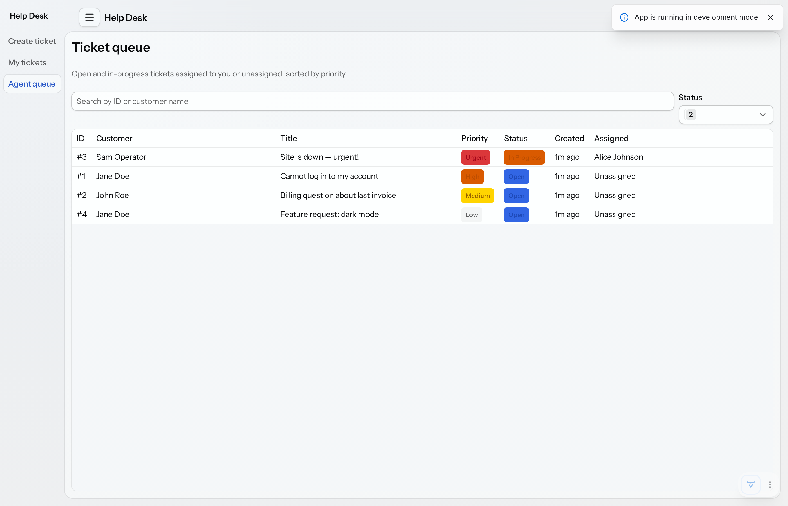
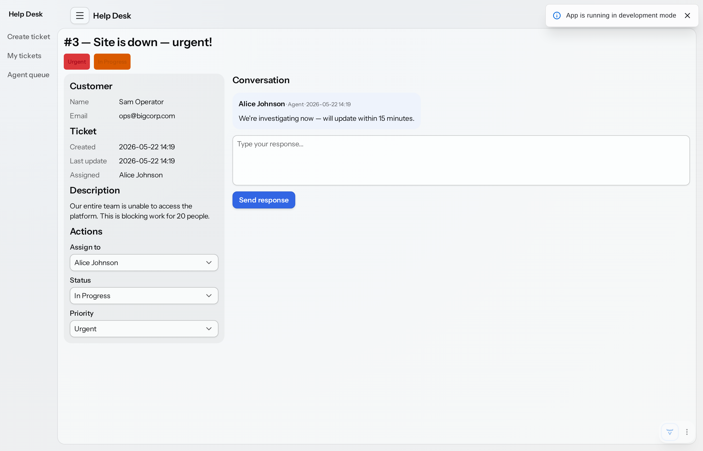
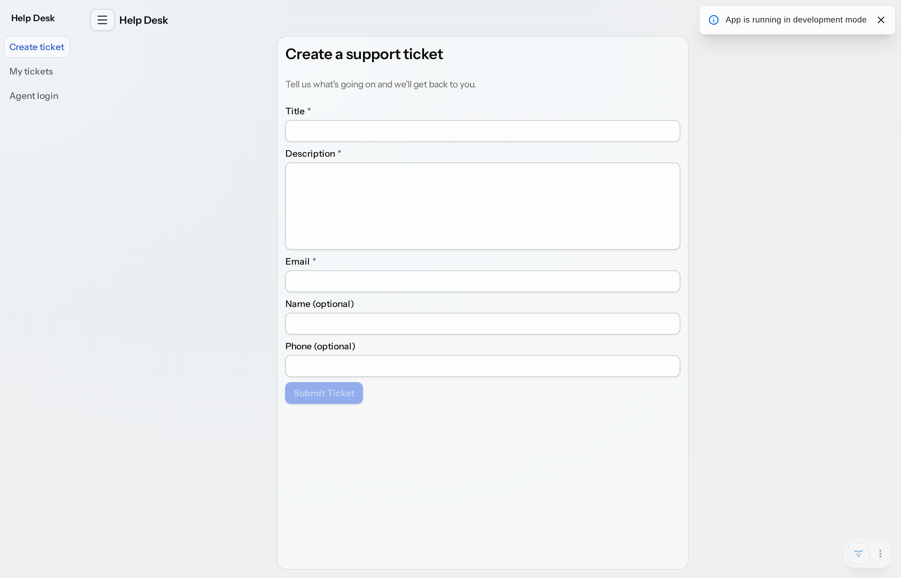

# Help Desk

A customer support help desk built with Vaadin Flow + Spring Boot. Customers create and track tickets; support agents work a prioritized queue, assign tickets, update status, and reply in a shared conversation thread.

Built spec-first — every feature in [`spec/use-cases/`](spec/use-cases/) is the source of truth for what was implemented.

## A look at the app

### Agent queue

Open and in-progress tickets the logged-in agent is responsible for, sorted by priority (Urgent → Low) with color-coded badges. Search by ticket ID / customer name and filter by status.



### Ticket detail

Two-column layout with customer info, ticket metadata, and agent action panel (assign, status, priority) on the left; conversation thread with reply box on the right. Agents see the action panel; customers see a read-only view of the same thread.



### Create ticket (public)

The customer-facing form. Title, description, and email are required; submit is disabled until they're filled in.



## Running it

```bash
./mvnw                              # dev server on :8080
./mvnw test                         # run tests
./mvnw clean package                # production build
```

See [DEVELOPMENT.md](DEVELOPMENT.md) for more.

### Try it

- Open <http://localhost:8080/> — anonymous lands on the ticket-creation form.
- Submit a ticket, then visit **My tickets** to track it (identified by email).
- Log in as an agent at <http://localhost:8080/login> with `alice` / `password` (or `bob` / `password`) and work the queue.

## How it's structured

| Layer | Where |
|-------|-------|
| Domain (JPA) | `src/main/java/com/example/domain/` |
| Repositories | `src/main/java/com/example/repository/` |
| Services (business rules) | `src/main/java/com/example/service/` |
| Security | `src/main/java/com/example/security/` |
| Vaadin Flow views | `src/main/java/com/example/ui/` |
| Seed data | `src/main/java/com/example/init/DataInitializer.java` |

The architecture, data model, design system, and feature specs all live in [`spec/`](spec/). See [CLAUDE.md](CLAUDE.md) for the conventions that always apply.

## Spec-driven workflow

This repo follows a spec-first workflow: features are defined as use cases under [`spec/use-cases/`](spec/use-cases/), then implemented one at a time. The original template README explained the workflow in detail — the key commands are:

| Skill | Purpose |
|-------|---------|
| `/new-use-case` | Interview-style creation of a new use case file |
| `/implement-use-case <name-or-number>` | End-to-end: code, visual verification, tests, commit |
| `/visual-verification` | Run Playwright against the app and check the UI |
| `/use-case-tests` | Write and run automated tests |

If the AI gets something wrong, the fix is usually to sharpen a rule in `spec/architecture.md`, `spec/design-system.md`, or the use case itself — not to repeat yourself in chat.

## More

- [`spec/README.md`](spec/README.md) — full spec structure and workflow
- [DEVELOPMENT.md](DEVELOPMENT.md) — build, run, and test commands
- [CLAUDE.md](CLAUDE.md) — repo conventions (Aura theme, security, architecture rules)
